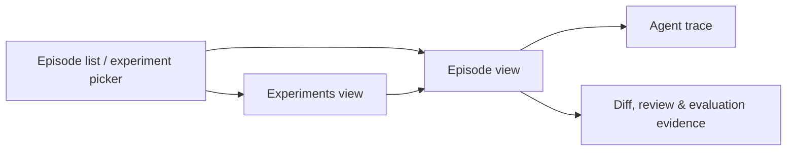

# Autonomous Engineering Agent — Demo Dashboard Proposal

## Purpose

Build a polished, read-only front-end that turns the project’s raw experiment artifacts into a clear demo story:

> A GitHub issue enters an isolated Daytona sandbox, specialised agents investigate and implement a fix, the system evaluates the episode, and repeated runs reveal which policy performs best.

The dashboard should make that story understandable in under two minutes, while still allowing a technical reviewer to inspect the underlying evidence.

## Dashboard-first architecture decision

The dashboard may be built before the agent runner, sandbox integration, or persistent artifact store. To keep that sequencing safe, the dashboard is **contract-first**, not artifact-first:

- The client consumes a stable, versioned dashboard read model rather than importing runner files directly.
- A fixture/replay adapter is the first data source; a local artifact adapter and live runner integration replace it incrementally.
- Every card handles `pending`, `skipped`, `partial`, and `error` states. The Planner, Reviewer, hidden evaluation, reward, diff, and cost may be absent or arrive at different times.
- Events are append-only and carry a stable ID, schema version, timestamp, agent/phase, action, observation, and optional structured metadata.
- Raw evidence (commands, test output, diffs) remains available, but the adapter supplies concise display fields rather than relying on the UI to parse unstructured model output.
- Seed fixtures must include: a clean pass, a failed-test-then-fix episode, reviewer rejection and retry, a failed hidden evaluation, and policies that skip Planner or Reviewer.

This lets the dashboard be independently built, rehearsed, and deployed now while ensuring the runner later integrates through an explicit boundary rather than accidental file-format coupling.

## Demo goals

1. Show a live or replayed agent episode progressing from issue to evaluated result.
2. Make the closed-loop Coder behaviour visible: implement → test → observe failure → fix → pass.
3. Prove that every run is measurable with trace, evaluation, cost, latency, and reward data.
4. Compare policies across the same benchmark tasks without asking the audience to read JSON files.
5. Keep the scope aligned with the hackathon: a compelling observability layer, not an operations console.

## Audience and primary journey

The primary audience is a hackathon judge or engineering leader. They should be able to:

1. Open the dashboard and understand the current run at a glance.
2. Follow the Planner, Coder, and Reviewer handoffs in the episode trace.
3. Open the final diff, test results, reviewer decision, and reward breakdown as evidence.
4. Switch to the experiment comparison and see why one policy is the strongest candidate.

## Product scope

Implement the three views defined in the technical plan, with a lightweight overview state for navigation.

### 1. Episode view — “What is happening now?”

This is the default screen and the centrepiece of the demo. It works for a currently running episode and for a completed episode replay.

**Header**

- Issue title and task ID, repository, pinned base commit, and selected policy.
- A status pill: `Running`, `Passed`, `Failed`, or `Error`.
- A compact elapsed-time display and sandbox lifecycle state.

**Agent pipeline**

Represent `Planner → Coder → Reviewer → Evaluation` as a horizontal pipeline. Each stage shows one of: queued, running, passed, rejected, skipped, or errored.

For policy B, Reviewer is visibly skipped. For policy D, a reviewer rejection creates a labelled feedback loop back to Coder rather than looking like a broken flow.

**Live metrics strip**

Show only the signals that help tell the story:

| Metric | Source |
| --- | --- |
| Tests | latest test event / `eval.hard.tests_pass` |
| Actions | total trajectory events |
| Coder iterations | `eval.soft.coder_iterations` |
| Reward | `eval.reward` when available |
| Cost | total input + output tokens |
| Duration | `eval.cost.wall_ms` or current elapsed time |

**Evidence cards**

- **Planner output:** diagnosis, files identified, and implementation plan.
- **Coder result:** changed-file count, final diff summary, and last test result.
- **Reviewer gate:** approve/reject, four-rubric checklist, and actionable issues.
- **Evaluation:** hard-signal checks plus an expandable reward calculation.

The evaluation card must make the distinction between visible tests and the hidden evaluation command explicit. A green visible test alone must not imply a successful episode.

### 2. Agent trace view — “Why did it reach that result?”

The trace is an inspectable, chronological rendering of `events.jsonl`; it should not invent its own event model.

**Layout**

- Left rail: agent filter (`All`, `Planner`, `Coder`, `Reviewer`) and event count.
- Main timeline: ordered, numbered actions with agent colour, timestamp, duration, tool name, short input, and outcome.
- Detail drawer: full command/input and clipped observation output for the selected event.

**Important interactions**

- Highlight test commands and render pass/fail clearly.
- Group consecutive events belonging to the same agent turn to reduce visual noise.
- Mark a reviewer rejection and subsequent Coder retry as a linked sequence.
- Offer a “failure-to-fix” focus mode that starts at the first failed test and ends at the passing rerun.

Avoid streaming every log character. The dashboard should surface the decision trail first, with raw output available on demand.

### 3. Experiments view — “Which policy should we use?”

This view reads one experiment result file and aggregates episodes by policy.

**Comparison table**

| Policy | Success rate | Average reward | Median duration | Average tokens | Avg. coder steps | Reviewer approval |
| --- | ---: | ---: | ---: | ---: | ---: | ---: |

The first three columns—success rate, reward, and cost—should be visually prioritised. Include a `Best overall` badge only when enough completed runs exist to make the label meaningful.

**Supporting visualisation**

- A reward-versus-cost scatter plot: each point is an episode and its colour represents policy.
- Clicking a point opens its Episode view.
- A task-by-policy matrix highlights where a policy succeeds or fails, so averages cannot hide inconsistent behaviour.

## Information architecture

## Data contract and ingestion

The front end should consume a small, stable, versioned read model created from existing artifacts rather than reading arbitrary files in the browser. The initial fixture source and future artifact source both conform to the same API.

| Dashboard need | Existing artifact |
| --- | --- |
| Episode identity, policy, status, sandbox | `result.json` |
| Timeline | `events.jsonl` |
| Planner card | `plan.json` |
| Reviewer card | `review.json` |
| Diff summary/detail | `diff.json` |
| Reward and metrics | `eval.json` |
| Cross-policy comparison | `.data/experiments/<timestamp>.json` |

Add a thin local API or build-time importer that normalises these into:

- `GET /api/episodes` — episode summaries, newest first.
- `GET /api/episodes/:id` — full episode detail and timeline.
- `GET /api/experiments` — available experiment runs.
- `GET /api/experiments/:id` — aggregated policy and task comparison.

The response payloads should include `schema_version`. New fields are additive; missing optional fields describe legitimately incomplete work, not an invalid response.

For a live demo, poll the active episode every 1–2 seconds. Because the runner appends events and writes final artifacts only after evaluation, the UI should tolerate partial data and show `Reward pending` until `eval.json` appears.

## Recommended implementation

Create a separate `dashboard/` client to avoid disturbing the agent runner. A focused React + TypeScript application with Vite is sufficient:

- **React + TypeScript + Vite:** fast, isolated dashboard build.
- **Tailwind CSS + a small component set:** high visual polish without a large design-system investment.
- **Recharts (or similar):** experiment comparison chart only; do not chart the trace.
- **Local Node API:** reads `.data/` safely, parses JSONL once, and exposes the view-specific read model.
- **Static fixture mode:** ships representative completed episodes when keys or Daytona access are unavailable; label it `Replay` to preserve trust.

Use a dark, high-contrast engineering-console aesthetic. The visual hierarchy should favour status, tests, and reward over decorative graphics. Green and red indicate outcomes only; agent identity should use distinct non-semantic accent colours.

## Delivery plan

### Phase 1 — Contract and replay foundation

- Define the versioned dashboard read model and fixture adapter before connecting any runner data.
- Create the dashboard shell, navigation, and representative fixture/replay mode.
- Build the Episode view with pipeline, metrics, and evidence cards.
- Build the chronological trace and event detail drawer.
- Build the experiment table from existing experiment JSON.

**Outcome:** a completed episode and experiment can be demonstrated end-to-end without the agent system being available.

### Phase 2 — Artifact adapter and live polish

- Add the adapter that maps episode and experiment artifacts into the dashboard contract.
- Add polling and partial-episode states.
- Add test failure-to-fix linking and reviewer-to-coder retry visualisation.
- Add the reward-versus-cost scatter plot and task-by-policy matrix.
- Add empty, error, and no-data states.

**Outcome:** the dashboard feels alive during a runner invocation and remains useful for replay.

### Phase 3 — Presentation hardening

- Seed a known-good replay data set.
- Ensure the default screen tells the happy-path story without setup.
- Add responsive behaviour for a 13-inch laptop display and a presentation display.
- Perform a demo rehearsal using the exact benchmark task and policy mix.

**Outcome:** predictable hackathon demo flow with inspectable proof behind every claim.

## Acceptance criteria

A dashboard is ready for the demo when it can:

- Load a completed run from `.data/episodes/` and render its planner, coder, reviewer, diff, evaluation, and event artifacts.
- Show an incomplete run without errors while events are still being written.
- Make a failed test, subsequent fix, and passing rerun visible in the trace.
- Explain reward with its hard signals and penalties rather than presenting an unexplained score.
- Compare policies from one experiment file and allow drill-down to an individual episode.
- Operate entirely against local run data with no additional external service required.

## Explicit non-goals

- Editing issues, tasks, policies, prompts, or sandboxes from the dashboard.
- Managing GitHub PRs or Daytona environments.
- Building a generic analytics warehouse or multi-user authentication.
- Building a custom agent workflow editor.

Those features would dilute the core demo: trajectories are the evidence, evals are the measurement, and experiments show the policy trade-off.
