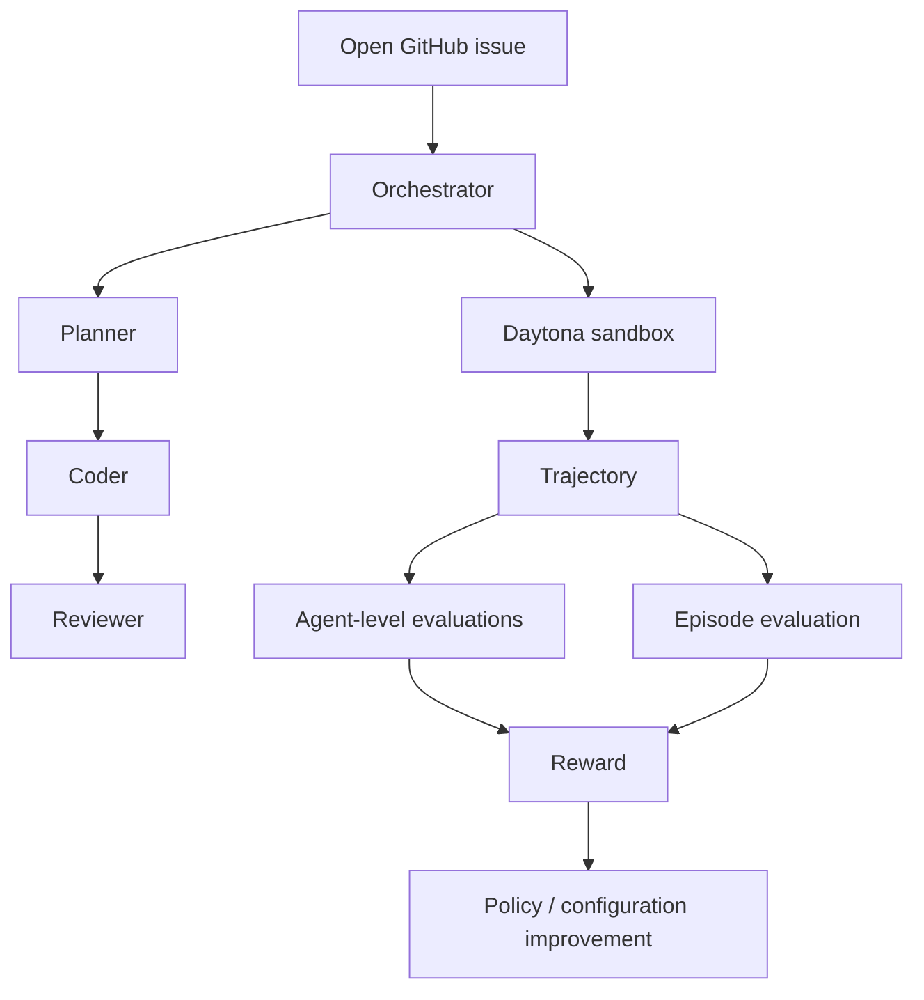

# Autonomous Engineering Agent — Technical Plan

## 1. Goal

Build a multi-agent system that autonomously takes a GitHub issue through implementation, tests, review, and PR creation with no human intervention.

Every run must be measurable:

```text
Agent → Environment → Trajectory → Agent Evals → Episode Eval → Reward
```

The hackathon prototype demonstrates multiple agent configurations on the same engineering tasks and uses evaluation signals to identify better-performing policies.

## 2. Core architecture



Daytona is the reproducible environment. The trajectory is the record of observations and actions. Evaluations turn the trajectory into reward, which makes policy comparison possible.

## 3. Planner

**Responsibility:** understand an issue and produce an implementation plan.

**Inputs:** GitHub issue, repository, repository metadata, and available tools.

**Actions:** inspect files and history, search the repository, identify relevant code, and produce a plan.

**Output:** diagnosis, relevant files, and ordered implementation steps.

**Evaluations:** issue understanding, diagnosis correctness, relevant-file identification, plan completeness, hallucination rate, and unnecessary exploration.

## 4. Coder

**Responsibility:** turn the plan into a working implementation.

**Inputs:** issue, Planner output when present, and repository.

**Actions:** read and modify files, execute commands, run tests, inspect failures, and iterate.

The Coder is closed-loop:

```text
Implement → run tests → observe failure → reason → modify → run tests → … → pass
```

It must not produce a patch and stop. Evaluate correctness, passing tests, iterations, unnecessary tool calls, changed files, regression risk, time/compute, and task completion.

## 5. Reviewer

**Responsibility:** independently evaluate the solution before a PR is opened.

**Inputs:** original issue, repository, git diff, test results, and Coder trajectory.

**Actions:** inspect the diff and relevant code, run additional tests, identify missing requirements/regressions, then approve or reject.

**Output:** verdict, actionable issues, and a review rubric. When rejected, feedback returns to Coder for a bounded retry loop.

## 6. Daytona environment

Every task runs in an isolated Daytona sandbox:

```text
Create sandbox → clone repository → checkout base commit → install dependencies
→ run episode → run evaluation → collect artifacts → destroy sandbox
```

The sandbox contains the repository, filesystem, terminal, language runtimes, dependencies, tests, and git. Every experiment begins from the same repository state.

## 7. Trajectory model

Every agent action becomes an event with at least:

```json
{
  "episode_id": "…",
  "agent": "coder",
  "step": 17,
  "action": { "tool": "terminal", "input": "npm test" },
  "observation": { "exit_code": 1, "output": "3 tests failed" },
  "timestamp": "…"
}
```

An episode is the sequence of Planner trajectory, Coder trajectory, Reviewer trajectory, and final evaluation. This is the fundamental RL dataset and must be preserved as inspectable evidence.

## 8. Evaluation architecture

Use two layers:

- **Agent-level:** Planner diagnosis/exploration/plan quality; Coder correctness/efficiency/test behaviour/implementation quality; Reviewer bug detection/requirement coverage/review accuracy.
- **Episode-level:** whether the entire system solved the engineering task.

Episode hard signals: tests pass, hidden tests pass, build succeeds, issue requirements are satisfied, and no regression is introduced. Soft signals: code quality, review output, efficiency, tool usage, and compute cost.

## 9. Reward

Start deterministic and simple, normalised to `[0, 1]`:

```text
+1.0 all tests pass
+0.5 issue requirements satisfied
+0.2 regression tests pass
+0.1 reviewer approves
-0.1 unnecessary actions
-0.1 excessive iterations
-0.1 excessive compute
```

The exact weighting can evolve. The non-negotiable property is that agent behaviour produces measurable reward.

## 10. Learning layer

Do not build full model training or fine-tuning for the hackathon. Build the infrastructure that can support learning later.

Compare policy variants against the same benchmark, for example:

- A: Planner → Coder → Reviewer
- B: Planner → Coder
- C: Coder → Reviewer
- D: Planner → Coder → Reviewer with reviewer-to-coder retry

Collect trajectory, reward, success, cost, and latency for each run.

## 11. Benchmark

GitHub issues become episodes. Start with 5–10 curated issues with clear expected behaviour, deterministic tests, reasonable runtime, genuine code changes, and varying difficulty.

Each task includes repository, base commit, issue, test command, and evaluation command. Prefer a constrained benchmark over generic arbitrary-GitHub support.

## 12. Experiment runner

An experiment chooses a benchmark, agent versions, number of episodes, and the Daytona environment. The runner creates a sandbox, loads a task, runs agents, records the trajectory, runs evaluations, computes reward, stores results, destroys the sandbox, and repeats in parallel.

## 13. Minimal data model

| Entity | Key fields |
| --- | --- |
| Task | task ID, repository, commit, issue, test command |
| Episode | episode ID, task ID, configuration, status, start/end time, reward, success |
| Agent run | agent run ID, episode ID, agent, model, policy version |
| Event | event ID, agent run ID, step, action, observation, timestamp |
| Evaluation | evaluation ID, episode ID, agent, metric, score |

## 14. Observability

Use one common event/trace format. An episode contains Planner, Coder, and Reviewer spans, each with tool calls, observations, and outputs. This makes a trajectory inspectable and comparable across runs.

## 15. UI

The dashboard should remain intentionally focused:

1. **Live Episode:** issue, agent progress, tests, actions, iterations, reward.
2. **Agent Trace:** chronological actions such as reading files, edits, test failures, fixes, and passing tests.
3. **Experiment:** policy comparison by success and reward.

See [the dashboard proposal](../DASHBOARD_PROPOSAL.md) for the contract-first implementation plan and detailed interaction design.

## 16. Hackathon scope

**Must have:** GitHub issue ingestion, Daytona sandbox, Planner, Coder, Reviewer, autonomous test/iteration loop, trajectory capture, agent- and episode-level evaluation, reward, experiment comparison, and PR creation.

**Nice to have:** parallel episodes, hidden tests, reviewer-to-coder retries, policy variants, reward-based optimisation, learning curves, and automatic experiment generation.

**Explicitly do not build:** full RL training infrastructure, sophisticated fine-tuning, generic agent-builder tooling, arbitrary-GitHub support, elaborate UI, or production-grade orchestration.

## 17. Definition of done

The demo must automatically show:

```text
GitHub issue → Daytona sandbox → Planner investigates → Coder implements
→ tests fail → Coder fixes → tests pass → Reviewer evaluates/approves
→ episode evaluated → reward calculated → PR opened
```

It then presents experiment results that compare policy success and reward.

> GitHub issues become episodes. Daytona becomes the environment. Evals become the reward. Agent trajectories become the learning data.
